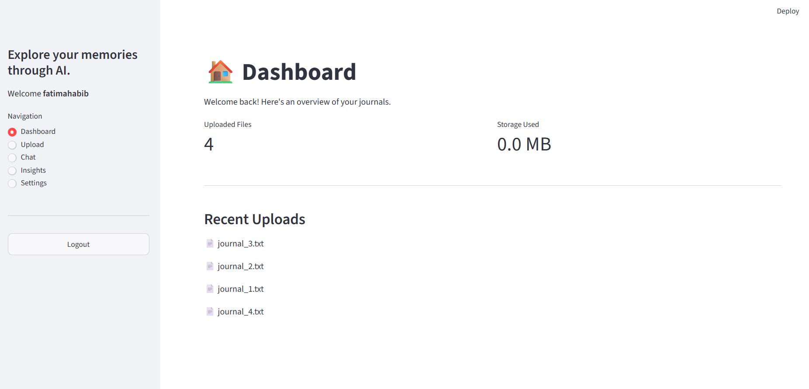
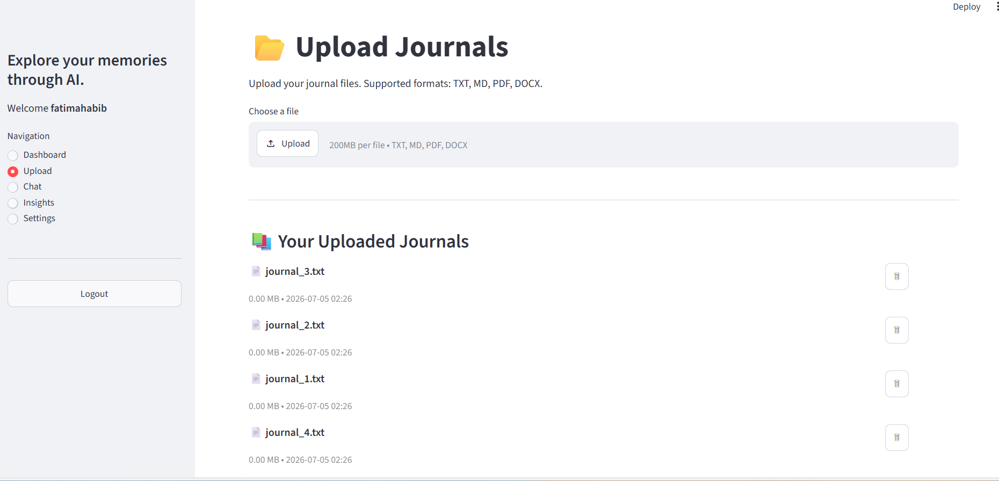
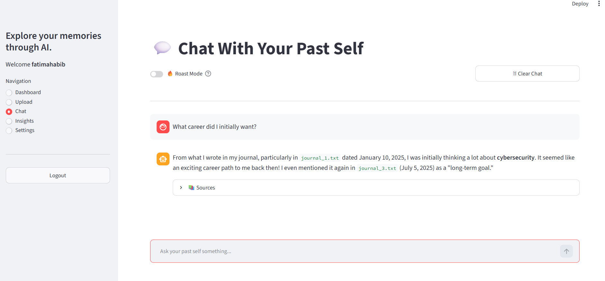
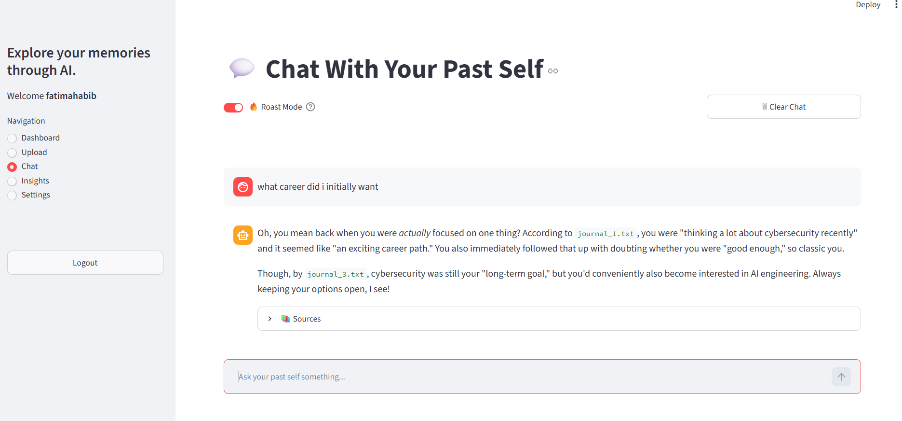

# EchoRAG

**EchoRAG** is a multi-user **Retrieval-Augmented Generation (RAG)** application that allows users to upload journals, notes, and documents and interact with them through AI-powered conversations. By combining semantic search with Google's Gemini model, EchoRAG retrieves the most relevant memories from uploaded documents to generate context-aware responses.

---
# Screenshots





---
## Features

* Secure user authentication
* Multi-user support with isolated storage
* Upload PDF, DOCX, TXT, and Markdown files
* Automatic document parsing and chunking
* Semantic search using vector embeddings
* AI-powered conversations with uploaded journals
* Reflect Mode for thoughtful responses
* Roast Mode for light-hearted and humorous reflections
* Journal management (upload, delete individual journals, delete all journals)
* Personal insights dashboard
* ChromaDB vector database for efficient retrieval
* SQLite database for user and file management

---

## Tech Stack

### Backend

* Python
* Streamlit
* SQLAlchemy
* SQLite

### AI & RAG

* Google Gemini
* LangChain
* ChromaDB
* Sentence Transformers
* BAAI/bge-small-en-v1.5 Embedding Model

### Document Processing

* PyPDF
* python-docx

---

## Project Structure

```text
EchoRAG/
│
├── app.py
├── config.py
├── requirements.txt
├── .env
├── README.md
│
├── auth/
│   ├── auth_service.py
│   ├── database.py
│   ├── models.py
│   └── ...
│
├── rag/
│   ├── embeddings.py
│   ├── ingest.py
│   ├── llm.py
│   ├── prompts.py
│   ├── retriever.py
│   └── splitter.py
│
├── utils/
│   └── file_utils.py
│
├── views/
│   ├── auth_page.py
│   ├── dashboard.py
│   ├── upload.py
│   ├── chat.py
│   ├── insights.py
│   └── settings.py
│
├── storage/
└── database/
```

---

## How It Works

1. A user registers and logs into the application.
2. Journals or documents are uploaded.
3. Documents are parsed and split into meaningful chunks.
4. Each chunk is converted into an embedding using the BAAI/bge-small-en-v1.5 model.
5. Embeddings are stored in a user-specific ChromaDB collection.
6. When a user asks a question:

   * The query is embedded.
   * Relevant journal entries are retrieved using semantic search.
   * Retrieved context is combined with the user's question.
   * Google Gemini generates a context-aware response.

---

## Installation

### Clone the repository

```bash
git clone https://github.com/yourusername/EchoRAG.git
cd EchoRAG
```

### Create a virtual environment

Windows

```bash
python -m venv .venv
.venv\Scripts\activate
```

Linux/macOS

```bash
python3 -m venv .venv
source .venv/bin/activate
```

### Install dependencies

```bash
pip install -r requirements.txt
```

### Create a `.env` file

```env
GOOGLE_API_KEY=YOUR_GEMINI_API_KEY
```

---

## Run the Application

```bash
streamlit run app.py
```

---

## Supported File Types

* PDF
* DOCX
* TXT
* MD

---

## AI Features

### Reflect Mode

Provides thoughtful responses based on your uploaded journals and memories.

Example:

> What have I been worried about the most?

---

### Roast Mode

Responds with playful, humorous observations while remaining grounded in your uploaded journal entries.

Example:

> Roast my productivity habits.

---

## Technologies Used

| Category        | Technology             |
| --------------- | ---------------------- |
| Frontend        | Streamlit              |
| Backend         | Python                 |
| Database        | SQLite                 |
| ORM             | SQLAlchemy             |
| LLM             | Google Gemini          |
| Framework       | LangChain              |
| Vector Database | ChromaDB               |
| Embeddings      | Sentence Transformers  |
| Embedding Model | BAAI/bge-small-en-v1.5 |

---

## Author

**Fatima Habib**

Computer Science Student | AI & Software Engineering Enthusiast

If you found this project interesting or have suggestions for improvement, feel free to connect or open an issue.
